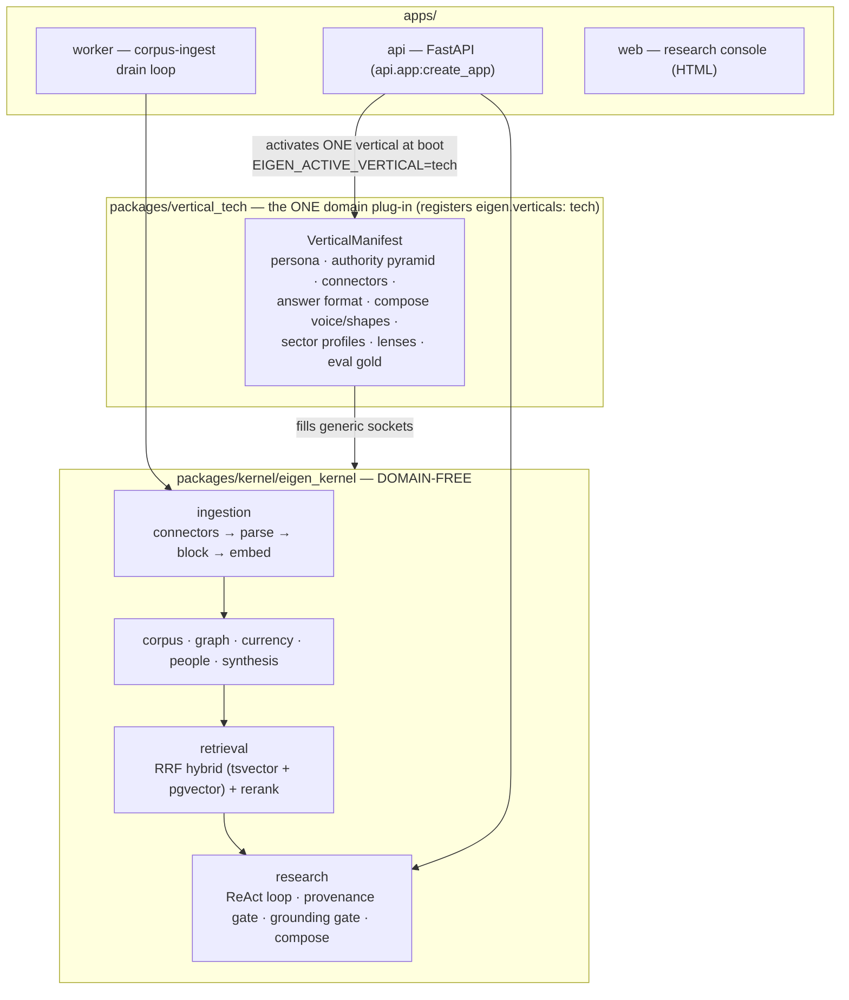

# Eigen

**A vertical-agnostic, evidence-grounded research engine — deployed here as a deep-tech / VC-diligence Q&A platform.**

You ask a natural-language question ("assess Anthropic's competitive position and funding trajectory as an investment"), and Eigen returns a written answer where *every* factual sentence is traceable to a real document it actually retrieved and quoted verbatim. It is not a chatbot that "knows things" — it is a research engine that *finds* things, quotes them, verifies the quotes physically exist in the source, and only then writes prose.

The one structural guarantee: **a fabricated citation cannot reach the reader.** Before any claim enters an answer, the model must supply a verbatim `quote`, and deterministic code checks that the exact string exists in the block the model cited (`packages/kernel/eigen_kernel/research/provenance.py`). A quote that isn't really there fails a substring check and the claim is dropped — no "close enough."

---

## Table of contents

- [The big idea](#the-big-idea)
- [Architecture: the kernel/vertical split](#architecture-the-kernelvertical-split)
- [Repository layout](#repository-layout)
- [How a question is answered](#how-a-question-is-answered)
- [How evidence gets in (ingestion)](#how-evidence-gets-in-ingestion)
- [The `tech` vertical](#the-tech-vertical)
- [Quickstart](#quickstart)
- [Configuration](#configuration)
- [API surface](#api-surface)
- [Deployment (Railway)](#deployment-railway)
- [Testing](#testing)
- [Feature-flag discipline](#feature-flag-discipline)
- [Further reading](#further-reading)

---

## The big idea

**The LLM owns MEANING; code owns STRUCTURE and PROVENANCE.**

Any judgment that requires understanding — *is this evidence relevant? what does this filing conclude? which claims actually answer the question? is this a company or a benchmark?* — is delegated entirely to the language model. Anything the model could *fabricate* is checked by deterministic code:

| Concern | Owner | Where |
|---|---|---|
| Relevance, classification, attribution, synthesis | **LLM** | prompts supplied by the vertical |
| "Does this quote physically exist in the cited block?" | **code** (hard gate) | `research/provenance.py` |
| Unhedged mechanism/causal claims without support | **LLM judge** (cross-family gate) | `research/grounding_gate.py` |
| Hard figures/dates/percentages in prose | **code** (token audit) | `research/react.py` (`_unsupported_prose_tokens`) |
| Evidence tier (filing > benchmark > press > blog) | **code** (structural, no semantics) | vertical `evidence_kind.classify` |

This split is a hard rule, not a style preference: **semantic decisions never get a regex/keyword shortcut**, and provenance decisions never get an LLM's opinion. It's why the answer is not merely plausible — it's *checkable*, sentence by sentence.

---

## Architecture: the kernel/vertical split

The single most important decision in the codebase: **the kernel may never learn a domain word.** It deals only in generic shapes — documents, blocks, facets, locators, claims, atoms. A *vertical* is a separate installable package that teaches the kernel exactly one domain by filling ~60 typed manifest slots with connectors, prompts, an authority pyramid, UI, and eval gold.



The contract between kernel and vertical is a set of `@runtime_checkable` Python `Protocol`s in `packages/kernel/eigen_kernel/contract/`. A deployment activates **exactly one** vertical, named by `EIGEN_ACTIVE_VERTICAL`; the kernel discovers all installed verticals through the `eigen.verticals` entry-point group (`runtime/build.py`).

> Eigen's kernel was forked from the Noesis medical kernel and renamed; the split is what made that a copy + rename rather than a rewrite. A legal or climate vertical could plug into the same kernel untouched. (Some inherited docs under `understand/` still say "Noesis/Medical" — they describe the same kernel mechanics.)

---

## Repository layout

```
eigen/
├── packages/
│   ├── kernel/eigen_kernel/          # DOMAIN-FREE evidence/research kernel
│   │   ├── contract/                 #   the vertical-facing Protocols + VerticalManifest
│   │   ├── ingestion/                #   connector → parse → block → embed pipeline
│   │   ├── corpus/                   #   Document→ParsedDoc→Block store (one flat rs_block table)
│   │   ├── retrieval/                #   RRF hybrid retrieval (tsvector + pgvector) + rerank
│   │   ├── research/                 #   ReAct loop, provenance gate, grounding gate, compose
│   │   ├── providers/                #   cassette-wrapped LLM/web providers (replay/record/live)
│   │   ├── graph/  currency/         #   claim graph + corpus-freshness (Pulse)
│   │   ├── people/ synthesis/        #   specialist/people index + answer synthesis
│   │   ├── runtime/  registries/     #   service wiring + vertical discovery
│   │   └── eval/  conformance/       #   held-out eval harness + VerticalConformance suite
│   └── vertical_tech/eigen_vertical_tech/   # THE one vertical (deep-tech / VC-diligence)
│       ├── manifest.py               #   build_manifest() -> VerticalManifest(name="tech", …)
│       ├── connectors/               #   24 free/no-key sources (edgar, arxiv, github, gdelt, …)
│       ├── authority.py evidence_kind.py    # tech evidence pyramid + structural classifier
│       ├── golden_answer.py reasoned.py     # compose voice/shapes + deep-synthesis format
│       ├── sectors.py lenses.py             # SECTOR_PROFILES (ai, …) + diligence lenses
│       └── data/*.json               #   offline fixture corpus
├── apps/
│   ├── api/                          # FastAPI app — activates the vertical, serves /research etc.
│   ├── worker/                       # corpus-ingest drain loop (docling PDF parsing)
│   └── web/                          # research console (HTML/JS)
├── deploy/                           # Dockerfile + start.sh (one image, two roles) + deploy README
├── scripts/                          # run_downloads.py (ingest campaigns), screening, graph build
├── evals/  understand/  learnings/   # eval cassettes, guided architecture tour, session learnings
├── railway.toml  pyproject.toml      # workspace anchor + Railway build/deploy config
└── CLAUDE.md                         # operating rules for AI agents working in this repo
```

---

## How a question is answered

The heart of the system is a **ReAct loop** (`packages/kernel/eigen_kernel/research/react.py`) that alternates searching and reasoning, and runs the provenance gate on **every** claim:

1. **Plan / retrieve** — the question is turned into retrieval legs (hybrid corpus search + live web where the vertical routes it). Reciprocal-rank-fusion merges lexical (tsvector) and semantic (pgvector) hits, then a reranker orders them.
2. **Gather atoms** — retrieved passages are mined for candidate facts ("atoms").
3. **Extract claims** — the model proposes claims, each with a verbatim `quote` and a source locator.
4. **Provenance hard gate** — code verifies each quote is a real substring of the cited block. Fails ⇒ the claim is discarded (`provenance.py`).
5. **Grounding gate** — an LLM judge flags unhedged mechanism/causal claims that the evidence doesn't carry; hedged, labeled analytical reasoning ("suggests / likely / appears") is explicitly exempt (`grounding_gate.py`).
6. **Compose** — surviving claims are composed into an answer with inline `[n]` citations, shaped by the vertical's compose voice + shape (see below). A hard-token audit re-checks that every figure/date/percentage in the prose is `[n]`-backed.

Supporting machinery: a per-run **budget governor** caps LLM spend; an **honesty signal** makes the model confess when evidence is only tangential; **resumable SSE** (`/stream/{run_id}`) survives the ~30–60s edge cut so long streaming runs don't lose their answer.

### Answer shape: voice ⟂ shape

Compose is factored into an orthogonal **voice** (how it talks — grounded, plain-spoken, fact-vs-inference separated) and a **shape** (selected per question: a direct answer, an enumerative table, a landscape survey). The tech vertical supplies both (`golden_answer.py`). A recent addition, `EIGEN_GOLDEN_SYNTHESIS`, makes compose *demand* a leading grounded analyst synthesis — the cross-item pattern + mechanism + forward thesis — instead of flat reporting, all hedged so it rides the grounding-gate exemption without loosening any provenance check.

---

## How evidence gets in (ingestion)

```
connector (source API)  →  parse (docling for PDFs)  →  block (chunk)  →  embed (OpenAI)  →  index into Postgres (rs_block: tsv + pgvector + jsonb facets)
```

Each block is stamped with generic **facets** (`source_kind`, `source_country`, `year`, `is_granted`, `is_peer_reviewed`, …) so the kernel never learns a domain word — the vertical's connectors set those keys with tech values. Ingestion runs in the **worker** role (`apps/worker`, `python -m worker.main`), a re-entrant drain loop over a job queue; a gap-fill queue self-heals thin coverage. `scripts/run_downloads.py` drives ranked, easy-first ingest campaigns across sources.

---

## The `tech` vertical

The active deployment is deep-tech research for an **investor / VC-diligence** persona: evidence-first, grounds every claim in a filing/patent/paper/repo/press quote, and separates *verified fact* from *market signal*.

**Tier-1 connectors (24, all free, no key) — `connectors/`:**

`edgar` (SEC filings + Form D private raises) · `patentsview` / `uspto` (patents) · `arxiv` (preprints) · `openalex` · `semantic_scholar` · `crossref` (scholarly + citations) · `github` (OSS traction) · `hackernews` / `lobsters` / `reddit` / `stackexchange` (developer sentiment) · `gdelt` (news/tone) · `wikidata` / `wikipedia` (entities) · `yc` (accelerator population) · `huggingface` / `openreview` (AI-sector signals) · `nih_reporter` / `nsf` (grants) · `companies_house` (UK filings) · `eng_blog` / `expert_feed` / `podcast` (long-form signal).

**Authority pyramid** (`authority.py` + `evidence_kind.py`) — a boost-only signal, never a provenance gate; higher = stronger:

```
primary_filing        6   SEC 10-K/S-1/8-K/Form D, GRANTED patents — attested/legal record
verified_structured   5   funding-DB records, reproducible benchmarks, peer-reviewed papers
analysis              4   major press (Reuters/Bloomberg/FT), analyst notes
preprint / tech_signal 2  arXiv (unreviewed), GitHub activity
sentiment_signal      1   HN, blogs, social, GDELT tone — perception, NOT fact
```

Sentiment is **labeled signal, never fact**: the classifier stamps social/news at `sentiment_signal` so it can never outrank a filing, and it is never `is_controlling`. `evidence_kind.classify` maps facets → tier *structurally* (no semantics — Rule 18).

**Diligence lenses** (`lenses.py`) — funding & traction, technology & IP, competitive landscape, market signal, team & execution — are within-vertical analytical angles, each with a retrieval focus and a panel specialist.

**Sectors** (`sectors.py`, `SECTOR_PROFILES`) are a per-question SUBJECT scope (AI, fintech, …), not separate deployments — one running app answers *across* sectors; adding a sector is one config entry.

---

## Quickstart

Requires **Python 3.13**. The repo is a `uv` monorepo; a local virtualenv lives at `.venv`.

```bash
# 1. install (editable, both packages + the serve extra)
uv sync                       # or: .venv/bin/pip install -e "packages/kernel[serve,postgres]" -e packages/vertical_tech

# 2. run the API + console offline (replay mode — free, no API keys)
EIGEN_ACTIVE_VERTICAL=tech EIGEN_PROVIDER_MODE=replay \
  PYTHONPATH=packages/kernel:packages/vertical_tech:apps \
  .venv/bin/uvicorn api.app:create_app --factory --port 8000
# → console at http://localhost:8000/   ·   health at /health   ·   config at /config
```

**Provider modes** (`EIGEN_PROVIDER_MODE`):

| Mode | Meaning | Needs |
|---|---|---|
| `replay` | offline, free — replays recorded cassettes | cassettes under `EIGEN_CASSETTE_ROOT` |
| `record` | real providers + saves a cassette | API keys |
| `live` | real providers, no cassette | API keys |

Ask a question against a running server:

```bash
curl -s -X POST http://localhost:8000/research \
  -H 'content-type: application/json' \
  -d '{"question":"How much did Mistral raise in its most recent round?","tenant_id":"demo"}' | jq .answer
```

---

## Configuration

Core env vars (see `.env.example` and `deploy/README.md`):

| Var | Purpose |
|---|---|
| `EIGEN_ACTIVE_VERTICAL` | which installed vertical to activate — `tech` for this deployment |
| `EIGEN_PROVIDER_MODE` | `replay` · `record` · `live` |
| `EIGEN_LLM_MODEL` | Anthropic model override (e.g. `claude-sonnet-5`) |
| `EIGEN_CORPUS_DSN` | Postgres+pgvector DSN for the corpus |
| `EIGEN_CASSETTE_ROOT` | cassette location (replay/record) |
| `ANTHROPIC_API_KEY` / `OPENAI_API_KEY` / `TAVILY_API_KEY` | LLM / embeddings / web search (record/live only) |
| `EIGEN_ROLE` | `api` (default) or `worker` (ingest drain) — both roles share one image |
| `PORT` | HTTP port (Railway sets this) |

Beyond these, ~120 `EIGEN_*` feature flags gate individual behaviors (see [Feature-flag discipline](#feature-flag-discipline)). Never commit real secrets.

---

## API surface

Selected endpoints (full set in `apps/api/*.py`):

**Research**
- `POST /research` · `POST /research/stream` — ask a question (blocking / SSE)
- `GET /stream/{run_id}` — resume a streaming run after an edge cut
- `POST /research/diligence` — diligence-memo shaped answer
- `POST /research/focus` — span-scoped follow-up ("go deeper" on a selected span)
- `POST /research/population` — enumerate a population of entities
- `POST /panel/ask` · `POST /panel/ask/stream` — AI specialist panel

**Intelligence surfaces**
- `GET /crossviews` · `POST /crossviews/build` · `POST /crossviews/agent` — dynamic grounded tables over the claim graph
- `GET /graph/explore` · `GET /graph/related` · `GET /admin/graph/view` — claim-graph navigation
- `GET /entity/{entity_id}` — entity page · `GET /glossary` — key-terms glossary
- `GET /pulse/*` — corpus-freshness (Evidence Pulse) watch/inbox/coverage

**Ops / admin**
- `GET /health` · `GET /config` · `GET /sessions` · `GET /sessions/{id}`
- `GET /admin/coverage` · `POST /admin/corpus/ingest` · `GET /admin/ingest/sources`
- `POST /auth/register` · `GET /admin/users`

---

## Deployment (Railway)

One Docker image, **two roles**, selected by `EIGEN_ROLE` (`deploy/start.sh`):

- `EIGEN_ROLE=api` (default) → `uvicorn api.app:create_app --factory`
- `EIGEN_ROLE=worker` → `python -m worker.main` (corpus-ingest drain, docling PDF parsing)

`railway.toml` builds `deploy/Dockerfile`, healthchecks `/health`, and runs **1 replica during the ingest-heavy phase** (two ingest drains would double-hammer rate-limited sources like arXiv). `overlapSeconds=30` + `drainingSeconds=300` keep a deploy from killing an in-flight research run (the FE recovers the answer via `/sessions`).

Prod topology: an `eigen-api` service (serves `/research`) and an `eigen-worker` service (drains the ingest queue). Connector changes must be deployed to **eigen-worker** to take effect. See `deploy/README.md` for the step-by-step.

---

## Testing

```bash
.venv/bin/python -m pytest packages/vertical_tech -q      # the tech vertical suite
.venv/bin/python -m pytest packages/kernel -q             # kernel unit tests
.venv/bin/python -m pytest -m conformance                 # VerticalConformance contract suite
.venv/bin/python -m pytest -m integration                 # requires a live Postgres
.venv/bin/python -m pytest                                # everything (skips slow by default)
```

Markers (`pyproject.toml`): `slow` (docling/parsing/soak), `integration` (live DB), `conformance` (vertical-contract suite).

**Verification strength matters** — importability < typecheck < unit < integration < held-out eval < prod-shadowing. LLM-behavior features are trusted only after a **held-out** eval (`packages/*/…/eval`, `evals/`) that is not contaminated by prompt few-shots. Provenance ("the quote exists") is necessary but never sufficient for correctness; semantic correctness needs gold-value checks. See `CLAUDE.md` for the full operating rules.

---

## Feature-flag discipline

User-visible or risky changes ship **behind an `EIGEN_*` flag, default OFF** (dark), so they roll out and roll back in prod without a redeploy. Both code paths are kept — the new behavior under the flag, the old as the default branch, byte-identical when OFF — so OFF is a true no-op. A flag is flipped ON only after the strongest relevant check passes and the OFF path is confirmed unchanged, then the ON path is verified in prod. Static gates are read from `os.environ`/config at build time; live gates that must flip without a redeploy use a DB-backed setting + an `/admin/...` endpoint.

---

## Further reading

- **`CLAUDE.md`** — operating rules for AI agents working in this repo (contract-first, LLM-owns-meaning, verification strength, judge panels, flag discipline).
- **`understand/`** — a guided, `file:line`-cited tour of the kernel's architecture, ingestion, and answering loop (written against the Noesis fork; the mechanics are identical).
- **`deploy/README.md`** — deployment specifics and env vars.
- **`packages/vertical_tech/eigen_vertical_tech/manifest.py`** — the single source of truth for everything the `tech` vertical teaches the kernel.
