# Eigen

**A vertical-agnostic, evidence-grounded research engine — deployed here as a deep-tech / VC-diligence Q&A platform.**

Ask a natural-language question — *"assess Anthropic's competitive position and funding trajectory as an investment"* — and Eigen returns a written answer where **every factual sentence is traceable to a real document it actually retrieved and quoted verbatim**. It is not a chatbot that "knows things." It is a research engine that *finds* things, quotes them, verifies the quotes physically exist in the source, and only then writes prose.

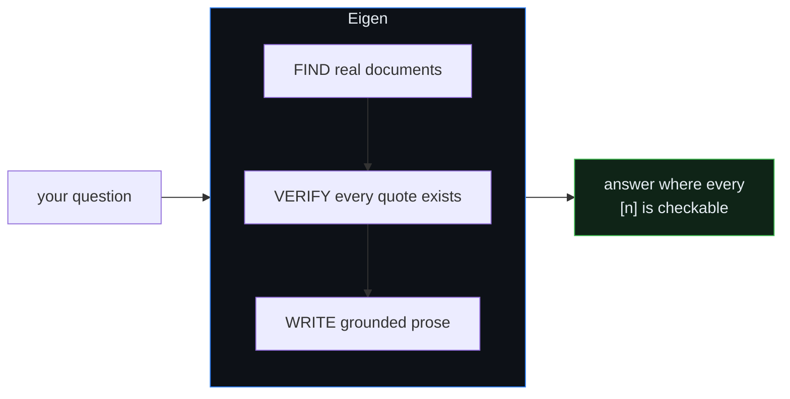

The one structural guarantee: **a fabricated citation cannot reach the reader.** Before any claim enters an answer, the model must supply a verbatim `quote`, and deterministic code checks that the exact string exists in the block the model cited (`packages/kernel/eigen_kernel/research/provenance.py`). A quote that isn't really there fails a substring check and the claim is dropped — no "close enough."

---

## Table of contents

- [Why Eigen exists](#why-eigen-exists)
- [A question, end to end](#a-question-end-to-end)
- [The mental model: two planes](#the-mental-model-two-planes)
- [Architecture: the kernel/vertical split](#architecture-the-kernelvertical-split)
- [Repository layout](#repository-layout)
- [The answer loop in detail](#the-answer-loop-in-detail)
- [The three gates](#the-three-gates)
- [Retrieval: hybrid RRF fusion](#retrieval-hybrid-rrf-fusion)
- [Ingestion: how evidence gets in](#ingestion-how-evidence-gets-in)
- [The response object](#the-response-object)
- [The `tech` vertical](#the-tech-vertical)
- [Answer shape: voice ⟂ shape](#answer-shape-voice--shape)
- [Quickstart](#quickstart)
- [Configuration](#configuration)
- [API surface](#api-surface)
- [Deployment (Railway)](#deployment-railway)
- [Testing & verification strength](#testing--verification-strength)
- [Feature-flag discipline](#feature-flag-discipline)
- [Further reading](#further-reading)

---

## Why Eigen exists

A general chatbot answers from parametric memory — it produces the *most likely* text, which is often right, sometimes confidently wrong, and never *checkable*. For work where being wrong is expensive — an investment memo, a competitive assessment, a diligence call — "plausible" is not good enough. You need to know *which document* a number came from, *how fresh* it is, and whether the model *reasoned* or *reported*.

Eigen is built for that. The contrast is the whole design:

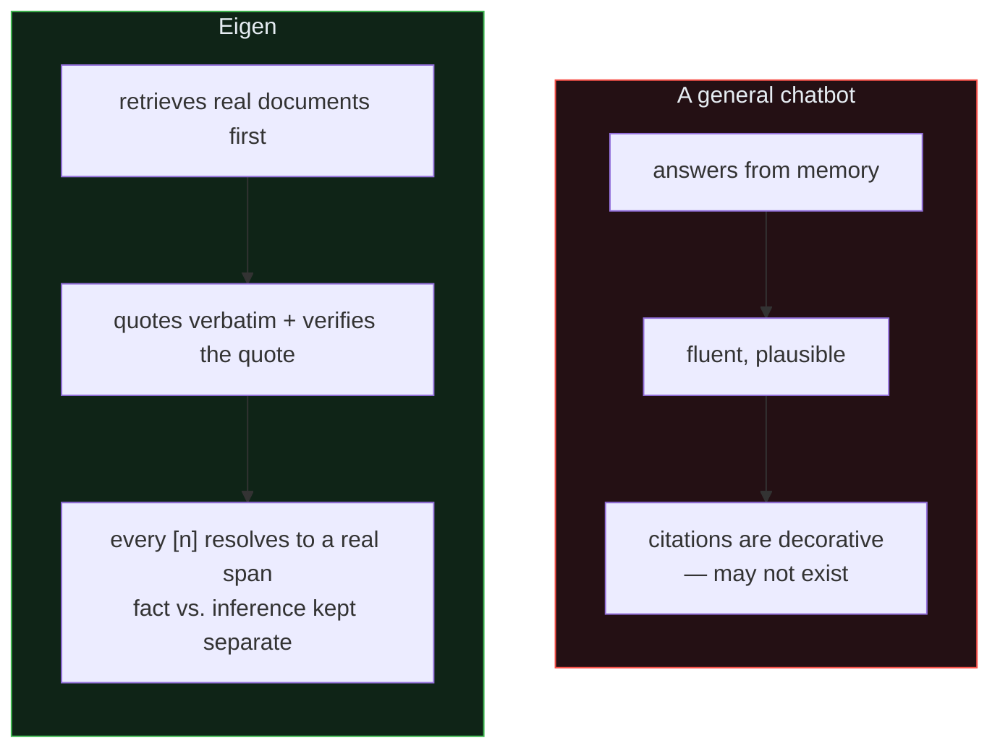

**The core principle:** the LLM owns *meaning*; code owns *structure and provenance*. Any judgment that needs understanding — is this relevant? what does this filing conclude? which claims answer the question? is this a company or a benchmark? — goes to the model. Anything the model could *fabricate* is checked by deterministic code. Semantic decisions never get a regex shortcut; provenance decisions never get the model's opinion.

---

## A question, end to end

Here is what actually happens when you `POST /research` with *"How much did Mistral raise in its most recent round?"* — a real prod trace:

```mermaid
sequenceDiagram
    autonumber
    participant U as You
    participant API as api.app
    participant R as ReAct loop
    participant RET as Retrieval
    participant LLM as Model
    participant G as Gates (code)

    U->>API: POST /research { question }
    API->>R: run(question)  · activates tech vertical
    R->>RET: hybrid search legs (corpus + web)
    RET-->>R: ranked blocks (RRF fused + reranked)
    R->>LLM: extract claims, each with a verbatim quote
    LLM-->>R: claim "raised $830M, Mar 30 2026" + quote + locator
    R->>G: provenance gate — is that quote a real substring?
    G-->>R: ✓ exists in the cited block
    R->>G: grounding gate — unhedged claim the evidence lacks?
    G-->>R: ✓ supported
    R->>LLM: compose answer with inline [n]
    LLM-->>R: prose; hard-token audit re-checks every figure/date
    R-->>API: grounded=true, answer, claims[], coverage_gaps[]
    API-->>U: answer + checkable citations
```

The claim that reaches you carries its own receipt — this is (abridged) what one looks like in the response `claims[]`:

```json
{
  "text": "Mistral AI's most recent funding round raised $830 million, announced March 30, 2026.",
  "quote": "$830 million ... to build new datacenters near Paris and in Sweden",
  "atom_id": "a1",
  "source": "web",
  "title": "Mistral AI raises $830M …",
  "url": "https://…/#:~:text=%24830%20million"
}
```

The `#:~:text=` fragment is a live deep-link to the exact quoted span. Because the gate proved the quote is a real substring of the cited block, the reader can click straight to the words.

---

## The mental model: two planes

Everything in Eigen lives on one of two planes. Keeping them separate is what makes the system both *smart* (the model does all the interpreting) and *honest* (code refuses to let it fabricate).

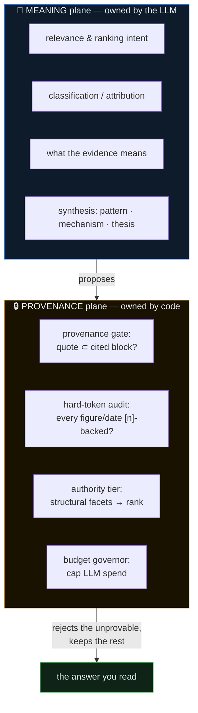

| Concern | Owner | Where in the code |
|---|---|---|
| Relevance, classification, attribution, synthesis | **LLM** | prompts supplied by the vertical manifest |
| "Does this quote physically exist in the cited block?" | **code** — hard gate | `research/provenance.py` |
| Unhedged mechanism/causal claims without support | **LLM judge** — cross-family gate | `research/grounding_gate.py` |
| Hard figures/dates/percentages in prose | **code** — token audit | `research/react.py` (`_unsupported_prose_tokens`) |
| Evidence tier (filing > benchmark > press > blog) | **code** — structural, no semantics | vertical `evidence_kind.classify` |
| LLM spend per run | **code** — budget governor | `research/budget.py` (`BudgetState`) |

---

## Architecture: the kernel/vertical split

The single most important decision in the codebase: **the kernel may never learn a domain word.** It deals only in generic shapes — documents, blocks, facets, locators, claims, atoms. A *vertical* is a separate installable package that teaches the kernel exactly one domain by filling ~60 typed manifest slots.

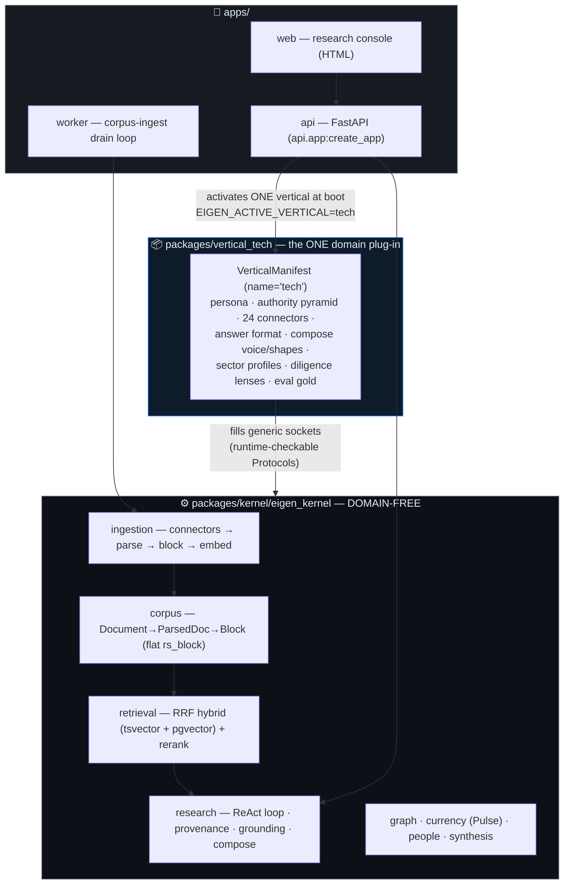

The contract between kernel and vertical is a set of `@runtime_checkable` Python `Protocol`s in `packages/kernel/eigen_kernel/contract/`. A deployment activates **exactly one** vertical (named by `EIGEN_ACTIVE_VERTICAL`); the kernel discovers all installed verticals through the `eigen.verticals` entry-point group (`runtime/build.py`). Adding a *sector* (AI, fintech, …) is one config entry; adding a whole new *vertical* (legal, climate) is a new package the kernel never has to know about.

> Eigen's kernel was forked from the Noesis medical kernel and renamed. The kernel/vertical split is exactly what made that a *copy + rename* rather than a rewrite — the medical domain lived entirely in its vertical, so swapping in `tech` touched no kernel code. (Some inherited docs under `understand/` still say "Noesis/Medical"; the mechanics they describe are identical.)

---

## Repository layout

```
eigen/
├── packages/
│   ├── kernel/eigen_kernel/          # DOMAIN-FREE evidence/research kernel
│   │   ├── contract/                 #   the vertical-facing Protocols + VerticalManifest
│   │   ├── ingestion/                #   connector → parse → block → embed pipeline
│   │   ├── corpus/                   #   Document→ParsedDoc→Block store (one flat rs_block table)
│   │   ├── retrieval/                #   RRF hybrid retrieval (BM25/tsvector + dense/pgvector) + rerank
│   │   ├── research/                 #   ReAct loop, provenance gate, grounding gate, budget, compose
│   │   ├── providers/                #   cassette-wrapped LLM/web providers (replay/record/live)
│   │   ├── graph/  currency/         #   claim graph + corpus-freshness (Evidence Pulse)
│   │   ├── people/ synthesis/        #   specialist/people index + answer synthesis
│   │   ├── runtime/  registries/     #   service wiring + vertical discovery
│   │   └── eval/  conformance/       #   held-out eval harness + VerticalConformance suite
│   └── vertical_tech/eigen_vertical_tech/   # THE one vertical (deep-tech / VC-diligence)
│       ├── manifest.py               #   build_manifest() -> VerticalManifest(name="tech", …)
│       ├── connectors/               #   24 free/no-key sources (edgar, arxiv, github, gdelt, …)
│       ├── authority.py evidence_kind.py    # tech evidence pyramid + structural classifier
│       ├── golden_answer.py reasoned.py     # compose voice/shapes + deep-synthesis format
│       ├── sectors.py lenses.py             # SECTOR_PROFILES (ai, …) + diligence lenses
│       └── data/*.json               #   offline fixture corpus
├── apps/
│   ├── api/                          # FastAPI app — activates the vertical, serves /research etc.
│   ├── worker/                       # corpus-ingest drain loop (docling PDF parsing)
│   └── web/                          # research console (HTML/JS)
├── deploy/                           # Dockerfile + start.sh (one image, two roles) + deploy README
├── scripts/                          # run_downloads.py (ingest campaigns), screening, graph build
├── evals/  understand/  learnings/   # eval cassettes, guided architecture tour, session learnings
├── railway.toml  pyproject.toml      # workspace anchor + Railway build/deploy config
└── CLAUDE.md                         # operating rules for AI agents working in this repo
```

---

## The answer loop in detail

The heart of the system is a **ReAct loop** (`research/react.py`) that alternates *searching* and *reasoning*, running the gates on **every** claim. It is re-entrant and self-recovering — it re-plans when the model abstains, falls back to a second model when the first is shy, and stops on a clear terminal reason.

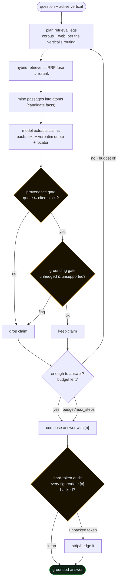

**Terminal states** (`stopped_reason` in the response): `answered` (the model has enough and is done), `budget` (the per-run LLM-call cap was hit), or `max_steps` (the loop's step ceiling). A **budget governor** (`research/budget.py`, `BudgetState.max_calls`) caps spend so a single question can't run away; an **honesty signal** makes the model confess when its evidence is only tangential rather than overstating; **resumable SSE** (`GET /stream/{run_id}`) survives the ~30–60s edge cut so a long streaming run never loses its answer.

---

## The three gates

Three independent checks stand between a proposed claim and the reader. They catch *different* failure modes — a claim must clear all three:

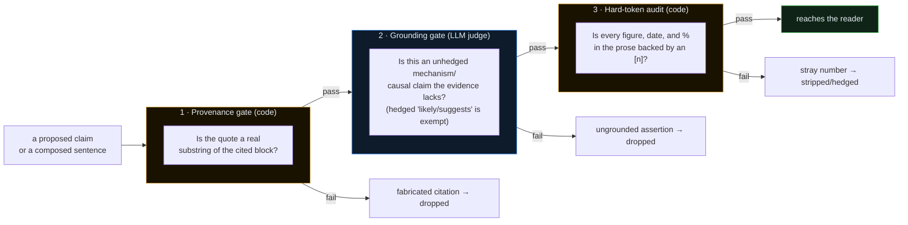

- **Provenance** proves the system *didn't fabricate* a citation — necessary, but not sufficient (a real quote can still be the *wrong* real quote).
- **Grounding** stops confident, unhedged interpretation the evidence doesn't carry — while *deliberately exempting* labeled analytical reasoning ("suggests / likely / appears"), so the answer can still *think*, out loud and honestly.
- **The token audit** is the last backstop: no bare figure, date, or percentage survives in prose unless an `[n]` stands behind it.

---

## Retrieval: hybrid RRF fusion

A single search modality misses things: lexical search nails exact terms but misses paraphrase; dense/vector search catches meaning but drifts on rare tokens. Eigen runs **both** and fuses them with **Reciprocal Rank Fusion** (`retrieval/fusion.py`, `RRF_K = 60`), which is robust to a weak partner leg — a strong dense leg can carry a coarse lexical one and vice-versa.

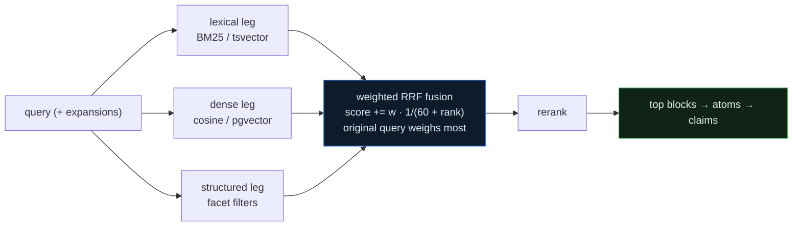

Corpus retrieval runs against Postgres (`pgvector` for dense, `tsvector` for lexical) over one flat `rs_block` table; the vertical decides which legs route to the corpus versus live web. Fusion is weighted — the original query outweighs its expansions, and a block that surfaces in *multiple* legs is boosted (`retrieval/dispatch.py`).

---

## Ingestion: how evidence gets in

Evidence enters through the **worker** role, a re-entrant drain loop over a job queue. Each stage commits independently, so a crash re-enters at the right point.

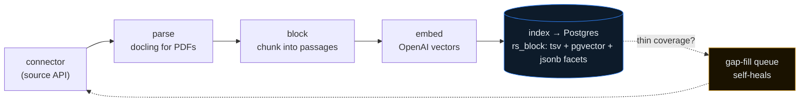

Every block is stamped with generic **facets** — `source_kind`, `source_country`, `year`, `is_granted`, `is_peer_reviewed`, … — so the kernel never learns a domain word; the vertical's connectors set those keys with tech values. `scripts/run_downloads.py` drives ranked, easy-first ingest campaigns across sources. Because ingest is rate-limited-source-heavy (arXiv 429s), prod runs **one** worker replica so two drains don't double-hammer.

---

## The response object

`POST /research` returns a rich JSON object — the answer *and* everything needed to audit it. The load-bearing fields:

| Field | What it is |
|---|---|
| `answer` | the composed prose with inline `[n]` citations |
| `grounded` | `true` only if the answer cleared the gates |
| `claims[]` | every cited claim: `text`, verbatim `quote`, `atom_id`, `source`, `title`, `url` (with `#:~:text=` deep-link) |
| `coverage_gaps[]` | what the evidence did *not* cover — the honest frame |
| `rejected[]` | claims the gates threw out |
| `source_stats` | which sources/legs contributed (corpus vs web, per connector) |
| `stopped_reason` | `answered` · `budget` · `max_steps` |
| `confidence` / `interpretation` | the reasoning-read layer's honesty signal |
| `freshness` | as-of dating for volatile facts |
| `companies` / `people` / `related_research` | structured entities linked from the answer |
| `session_id` | recover a run via `/sessions/{id}` (deploy-safe) |

The response is designed so a caller can *show its work*: render the prose, then let the reader click any `[n]` straight to the quoted span, and read `coverage_gaps` to know the boundary of what was actually established.

---

## The `tech` vertical

The active deployment is deep-tech research for an **investor / VC-diligence** persona: evidence-first, grounds every claim in a filing/patent/paper/repo/press quote, and separates *verified fact* from *market signal*.

**Tier-1 connectors (24, all free, no key) — `connectors/`:**

`edgar` (SEC filings + Form D private raises) · `patentsview` / `uspto` (patents) · `arxiv` (preprints) · `openalex` · `semantic_scholar` · `crossref` (scholarly + citations) · `github` (OSS traction) · `hackernews` / `lobsters` / `reddit` / `stackexchange` (developer sentiment) · `gdelt` (news/tone) · `wikidata` / `wikipedia` (entities) · `yc` (accelerator population) · `huggingface` / `openreview` (AI-sector signals) · `nih_reporter` / `nsf` (grants) · `companies_house` (UK filings) · `eng_blog` / `expert_feed` / `podcast` (long-form signal).

**Authority pyramid** (`authority.py` + `evidence_kind.py`) — a *boost-only* signal, never a provenance gate. Higher tiers win when sources conflict; sentiment can never outrank a filing:

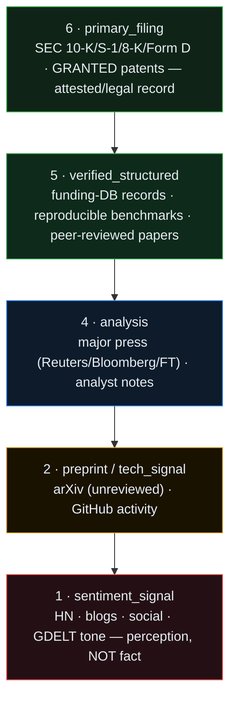

`evidence_kind.classify` maps facets → tier **structurally** (no semantics — code owns structure): a filing facet → `primary_filing`, a granted patent → `primary_filing`, peer-reviewed → `verified_structured`, news → `analysis`, social/HN/GDELT → `sentiment_signal`. Sentiment is **labeled signal, never fact**: it is stamped at the bottom tier and is never `is_controlling`, and the compose voice surfaces it as *market signal*, not a grounded claim.

**Diligence lenses** (`lenses.py`) — funding & traction, technology & IP, competitive landscape, market signal, team & execution — are within-vertical analytical angles, each with a retrieval focus and a panel specialist (`POST /panel/ask`).

**Sectors** (`sectors.py`, `SECTOR_PROFILES`) are a per-question *subject scope* (AI, fintech, …), not separate deployments — one running app answers *across* sectors, and adding one is a single config entry.

---

## Answer shape: voice ⟂ shape

Compose is factored into two orthogonal things (`golden_answer.py`), so the answer's *tone* never fights its *structure*:

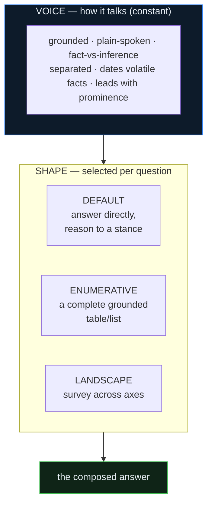

`EIGEN_GOLDEN_SYNTHESIS` (recently shipped) makes compose *demand* a leading grounded analyst synthesis — the cross-item **pattern** + the **mechanism** driving it + a **forward thesis** — instead of flat reporting. Crucially the synthesis is written in plain hedged language ("suggests / likely / appears") so it rides the grounding-gate exemption: the answer gains GPT-style depth **without loosening any provenance check**, and stays out of the way on narrow factual lookups.

---

## Quickstart

Requires **Python 3.13**. The repo is a `uv` monorepo; a local virtualenv lives at `.venv`.

```bash
# 1. install (editable, both packages + the serve extra)
uv sync                       # or: .venv/bin/pip install -e "packages/kernel[serve,postgres]" -e packages/vertical_tech

# 2. run the API + console offline (replay mode — free, no API keys)
EIGEN_ACTIVE_VERTICAL=tech EIGEN_PROVIDER_MODE=replay \
  PYTHONPATH=packages/kernel:packages/vertical_tech:apps \
  .venv/bin/uvicorn api.app:create_app --factory --port 8000
# → console at http://localhost:8000/   ·   health at /health   ·   config at /config
```

**Provider modes** (`EIGEN_PROVIDER_MODE`):

| Mode | Meaning | Needs |
|---|---|---|
| `replay` | offline, free — replays recorded cassettes | cassettes under `EIGEN_CASSETTE_ROOT` |
| `record` | real providers + saves a cassette | API keys |
| `live` | real providers, no cassette | API keys |

Ask a question against a running server:

```bash
curl -s -X POST http://localhost:8000/research \
  -H 'content-type: application/json' \
  -d '{"question":"How much did Mistral raise in its most recent round?","tenant_id":"demo"}' | jq '.answer, .grounded'
```

---

## Configuration

Core env vars (see `.env.example` and `deploy/README.md`):

| Var | Purpose |
|---|---|
| `EIGEN_ACTIVE_VERTICAL` | which installed vertical to activate — `tech` for this deployment |
| `EIGEN_PROVIDER_MODE` | `replay` · `record` · `live` |
| `EIGEN_LLM_MODEL` | Anthropic model override (e.g. `claude-sonnet-5`) |
| `EIGEN_CORPUS_DSN` | Postgres+pgvector DSN for the corpus |
| `EIGEN_CASSETTE_ROOT` | cassette location (replay/record) |
| `ANTHROPIC_API_KEY` / `OPENAI_API_KEY` / `TAVILY_API_KEY` | LLM / embeddings / web search (record/live only) |
| `EIGEN_ROLE` | `api` (default) or `worker` (ingest drain) — both roles share one image |
| `PORT` | HTTP port (Railway sets this) |

Beyond these, ~120 `EIGEN_*` feature flags gate individual behaviors (see [Feature-flag discipline](#feature-flag-discipline)). Never commit real secrets.

---

## API surface

Selected endpoints (full set in `apps/api/*.py`):

**Research**
- `POST /research` · `POST /research/stream` — ask a question (blocking / SSE)
- `GET /stream/{run_id}` — resume a streaming run after an edge cut
- `POST /research/diligence` — diligence-memo shaped answer
- `POST /research/focus` — span-scoped follow-up ("go deeper" on a selected span)
- `POST /research/population` — enumerate a population of entities
- `POST /panel/ask` · `POST /panel/ask/stream` — AI specialist panel

**Intelligence surfaces**
- `GET /crossviews` · `POST /crossviews/build` · `POST /crossviews/agent` — dynamic grounded tables over the claim graph
- `GET /graph/explore` · `GET /graph/related` · `GET /admin/graph/view` — claim-graph navigation
- `GET /entity/{entity_id}` — entity page · `GET /glossary` — key-terms glossary
- `GET /pulse/*` — corpus-freshness (Evidence Pulse) watch/inbox/coverage

**Ops / admin**
- `GET /health` · `GET /config` · `GET /sessions` · `GET /sessions/{id}`
- `GET /admin/coverage` · `POST /admin/corpus/ingest` · `GET /admin/ingest/sources`
- `POST /auth/register` · `GET /admin/users`

---

## Deployment (Railway)

One Docker image, **two roles**, selected by `EIGEN_ROLE` (`deploy/start.sh`):

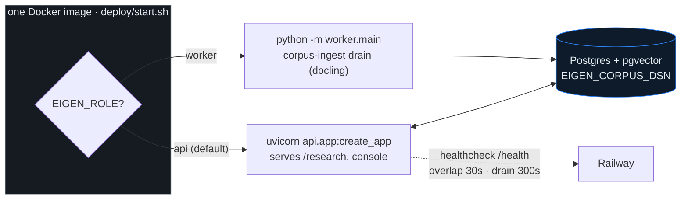

`railway.toml` builds `deploy/Dockerfile`, healthchecks `/health`, and runs **1 replica during the ingest-heavy phase** (two ingest drains would double-hammer rate-limited sources). `overlapSeconds=30` + `drainingSeconds=300` keep a deploy from killing an in-flight research run — the FE recovers the answer via `/sessions`. Prod topology: an `eigen-api` service (serves `/research`) and an `eigen-worker` service (drains the ingest queue). **Connector changes must be deployed to `eigen-worker`** to take effect. Step-by-step in `deploy/README.md`.

---

## Testing & verification strength

```bash
.venv/bin/python -m pytest packages/vertical_tech -q      # the tech vertical suite
.venv/bin/python -m pytest packages/kernel -q             # kernel unit tests
.venv/bin/python -m pytest -m conformance                 # VerticalConformance contract suite
.venv/bin/python -m pytest -m integration                 # requires a live Postgres
.venv/bin/python -m pytest                                # everything (skips slow by default)
```

Markers (`pyproject.toml`): `slow` (docling/parsing/soak), `integration` (live DB), `conformance` (vertical-contract suite).

A claim of "it works" is only as strong as the check behind it. Eigen holds itself to an explicit ladder — and reports honestly where on it a given result sits:

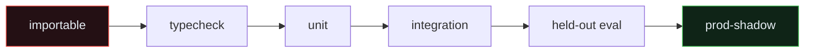

LLM-behavior features are trusted only after a **held-out** eval that is *not* contaminated by prompt few-shots. Provenance ("the quote exists") is necessary but never sufficient for correctness — semantic correctness needs gold-value checks. The full operating rules are in `CLAUDE.md`.

---

## Feature-flag discipline

User-visible or risky changes ship **behind an `EIGEN_*` flag, default OFF** (dark), so they roll out and roll back in prod without a redeploy. Both code paths are kept — the new behavior under the flag, the old as the default branch, byte-identical when OFF — so OFF is a true no-op. A flag flips ON only after the strongest relevant check passes *and* the OFF path is confirmed unchanged; then the ON path is verified in prod. Static gates are read from `os.environ`/config at build time; live gates that must flip without a redeploy use a DB-backed setting + an `/admin/...` endpoint.

---

## Further reading

- **`CLAUDE.md`** — operating rules for AI agents working in this repo (contract-first, LLM-owns-meaning, verification strength, judge panels, flag discipline).
- **`understand/`** — a guided, `file:line`-cited tour of the kernel's architecture, ingestion, and answering loop (written against the Noesis fork; the mechanics are identical).
- **`deploy/README.md`** — deployment specifics and env vars.
- **`packages/vertical_tech/eigen_vertical_tech/manifest.py`** — the single source of truth for everything the `tech` vertical teaches the kernel.
