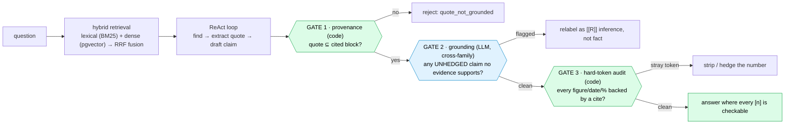

# Eigen: Auditable grounded reasoning — the difference between an AI that *sounds* like an analyst and one you'd put in a memo

*Repo: https://github.com/4sgupta828/eigen · a vertical-agnostic, evidence-grounded research engine · deployed as deep-tech / VC-diligence Q&A · a fabricated citation cannot reach the reader*

> **TL;DR for anyone who signs off on research:** A general chatbot answers from parametric memory — it produces the *most likely* text, which is often right, sometimes confidently wrong, and *never checkable*. For an investment memo, you need to know which document a number came from, how fresh it is, and whether the model *reasoned* or *reported*. Eigen's edge isn't more fluent prose; it's **auditable grounded reasoning** — the model does all the interpreting, while three independent gates make it structurally impossible to smuggle an unprovable fact past the reader. Frontier models reason brilliantly but ungrounded — you can't audit *why* a leap was made. Eigen makes every leap trace back to evidence and pass a "does this actually follow?" check.

---

## 1. The problem, in the language of a diligence partner

Ask a general model to "assess this company's competitive position and funding trajectory" and you get a fluent, authoritative answer that is part real, part confabulated — with no way to tell which sentence is which. That's not a time-saver; it's a landmine. The value of research was never the prose. It's **traceability** — being able to stand behind every claim because you can point to the source, and being able to tell a *reported fact* from the model's *inference.*

## 2. The thesis: find → quote → verify → write, behind three gates

Eigen is not a chatbot that "knows things." It retrieves real documents, extracts a **verbatim quote per claim**, verifies the quote physically exists, and only then composes prose. A claim must clear **three independent gates**, each catching a different failure mode.



**Gate 1 — provenance (deterministic).** The entire non-fabrication guarantee reduces to one line: a whitespace-normalized substring test of the model's `quote` against the tenant-scoped block it cited.

```python
# packages/kernel/eigen_kernel/research/provenance.py
def verify(self, quote, locator) -> bool:
    block_text = self._load(locator.document_id, block_id)
    if block_text is None:                       # out of scope / missing → fail closed
        return False
    q = normalize(quote)                          # tolerant of reflow, not of content
    return bool(q) and q in normalize(block_text)
```

A failed quote isn't repaired ("no close enough") — it's dropped into `rejected_claims` with reason `quote_not_grounded`, surfaced separately, never silently passed.

**Gate 2 — grounding (LLM, a *different model family*).** Gate 1 can't catch a *laundered qualitative claim* — a mechanism, entity, or causal link asserted as fact but present in no cited finding. So a cross-family judge (uncorrelated failure modes) re-reads only the answer and only the verified claims and flags unsupported assertions. It **exempts hedged reasoning** — text explicitly marked as the model's own inference ("likely / suggests / appears") is *not* flagged. That exemption is what lets the answer *think out loud* while staying honest. And it's **fail-closed**: no judge, empty answer, or judge error → it never weakens grounding and never blocks the answer.

**Gate 3 — hard-token audit (deterministic).** A final backstop: the set difference between hard tokens (figures, dates, %) in the prose and hard tokens in the verified findings. A stray number the sources don't state is stripped or hedged. The same primitive guards charts and interpretation items — one deterministic rule enforced everywhere the model adds prose.

## 3. Two finance-specific disciplines encoded in code

| Trap | Rule Eigen enforces (in code, not prompt) |
|---|---|
| Hype presented as fact | **Authority pyramid** — a 6-tier boost where sentiment is the *lowest* tier. `is_controlling()` returns True **only** for an audited filing / granted patent. Rank *boosts*, it never *gates* provenance |
| Roadmap read as reality | **Stated intent ≠ realized fact** — a patent *application* gets a `technical_signal` tier; only a *granted* patent gets `primary_filing`. "Has raised," never "is the best bet" |

```python
def is_controlling(self, evidence_kind: str) -> bool:
    return evidence_kind == "primary_filing"   # one line = "sentiment is signal, not fact"
```

## 4. The frontier feature: reasoned mode with a demotion ladder

The hard, interesting part — how do you let the model *reason* (the thing GPT is great at) without letting it fabricate? Eigen's answer is asymmetric strictness:

- A **fact** that fails its gate is **dropped.**
- A **reasoning step** that fails is **demoted one rung**: `inference → hypothesis → speculation → drop`.

The confidence label is *assigned by the gate, never self-declared*, and a derived claim must carry a non-empty `basis` and a one-line `warrant`. "Ambition lives in the demotion" — you get GPT-style depth without loosening a single provenance check.

## 5. Decisions and tradeoffs

| Decision | Alternative rejected | What we gave up | Why |
|---|---|---|---|
| find→quote→verify→write | Answer from memory | Fluency & latency (simple Q ~190s, enumerative ~260s) | "A fabricated citation cannot reach the reader" is worth the cost when being wrong is expensive |
| LLM owns meaning, code owns provenance | Hard-coded heuristics for relevance | Fast shortcuts | A regex can't judge relevance; a model can fabricate a citation. Each owns what it can't be fooled on |
| Sentiment = signal, never controlling | Let consensus buzz outrank a filing | Some "market read" weight | Rank boosts but never gates provenance — it rebalances without corrupting truth |
| Reasoned demotion ladder | Unlabeled confident synthesis | Simplicity | Buys depth without loosening any provenance check; the label is gate-assigned |
| Kernel/vertical split | Domain logic in the engine | Some indirection | Forked from the Noesis *medical* kernel — swapping in the `tech` vertical touched **no kernel code** |
| Hybrid RRF retrieval (`RRF_K=60`) | One modality | Speed/simplicity | Lexical nails exact terms, dense catches paraphrase; RRF is robust to a weak partner leg |
| ~120 flags, byte-identical OFF | Hard cutover | Dead branches kept | Prod roll-out/rollback without redeploy; ON only after the OFF path is confirmed unchanged |

## 6. How correctness is measured — including the honest holes

- **Conformance (phases P0–P5):** a registry of structural checks against the vertical manifest; each declares the minimum phase at which it becomes *required*, so partial manifests aren't failed for slots that don't exist yet. A pass proves the vertical fills the kernel contract — the CI gate every vertical must clear.
- **Held-out QA gold:** cases answerable *only* from the bundled fixture corpus (so a pass means grounded-a-real-fact or honestly-declined, never memorized), each with an `evidence_floor` — the minimum authority tier the top citation must reach. Includes a deliberate **refuse case** (a subject not in the corpus → the correct answer is "refuse, honest gap"). Scoring requires value-present, forbidden-values-absent, citation-grounded, *and* evidence-floor met — with a standalone-number guard so "3.8" doesn't match inside "13.8".
- **The candor that makes it credible:** the repo's own notes admit the measurement holes. A 50-question judge-panel stress test (scored by two external models) **failed** — every blocking call hit the platform's ~300s edge timeout (one measured at 300.17s), so quality scores are pending a streaming rerun. The tech vertical "has ZERO enumerative gold — the biggest eval hole." That honesty *is* the measurement discipline.

## 7. What stays genuinely hard (open problems, from the repo's own notes)

1. **Latency** — the acknowledged #1 gap; grounding costs time, and it literally broke the eval harness. Only a resumable streaming endpoint survives the edge timeout.
2. **The "sample = universe" trap** — "list ALL X" is only as complete as retrieval. A real captured bug: a table of AI coding assistants *dropped Claude Code* despite 436 corpus blocks (more than a competitor's 81) — retrieval starvation, not a coverage gap. A source-diversity cap now rebalances top-k without reducing recall.
3. **Inference provenance** — provenance ≠ correctness, stated repeatedly. A real quote can be the *wrong* real quote. The open build is a validity check: "given only these basis findings, does the conclusion follow?"
4. **Derivation / arithmetic** — the no-new-token rule blocks fabrication but also blocks legitimate math; the escape hatch (code re-derives a figure from basis operands) is still being built.
5. **Freshness** — volatile facts need as-of dating; graph densification is roadmap.

## 8. The AI-vs-deterministic-code boundary

*Any judgment that needs understanding goes to the model. Anything the model could fabricate is checked by deterministic code.* Concretely: relevance, attribution, and synthesis → LLM; "does this quote physically exist?" → code; evidence tier (filing > benchmark > press > blog) → code reading structured tags a source published *about itself*, never a semantic guess; LLM spend → a code governor. Even where a judge owns a semantic call (Gate 2), the code owns only the gate mechanics and the fail-closed contract.

## 9. How to take it from here

- Ship the streaming/resumable path everywhere so latency stops breaking evals and UX.
- Build enumerative gold + coverage-driven retrieval so a *sample* never masquerades as the *universe*.
- Finish the inference-provenance validity gate and the arithmetic escape hatch.
- Keep the kernel domain-free so legal, policy, and scientific verticals reuse it untouched.

## 10. Use cases → products

| Use case | Product |
|---|---|
| Deal diligence | A copilot that drafts the memo with every claim clickable |
| Portfolio monitoring | Flag when new filings/patents change a thesis |
| Multi-vertical research | A licensed "grounded research" platform per domain |

## 11. To understand the space

Retrieval-augmented generation · attributed QA (**AIS**) · reciprocal-rank fusion · financial NLP · the faithfulness/hallucination literature for long-form generation · the distinction between *reporting* and *reasoning* in machine-generated analysis.

---

*The future of AI research tools isn't a model that sounds like an analyst — it's an engine that can't make a claim it didn't retrieve, quote, and verify, and that labels its reasoning as reasoning.*

**#VentureCapital #InvestmentResearch #DueDiligence #RAG #FintechAI #TrustworthyAI #AIGovernance #ProductManagement**
