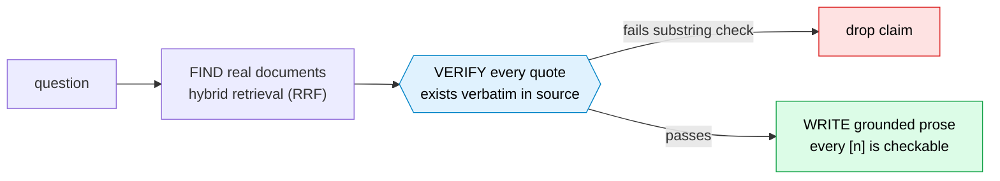

# Eigen: What would it take to trust AI with an investment memo?

*Repo: https://github.com/4sgupta828/eigen · evidence-grounded research engine · deployed as deep-tech / VC-diligence Q&A · a fabricated citation cannot reach the reader*

---

## The problem with "AI for research"

Ask a general model to "assess this company's competitive position and funding trajectory" and you get a fluent, authoritative answer that is part real, part confabulated — with no way to tell which sentence is which. For an analyst doing diligence, that's not a time-saver; it's a landmine.

The value of research was never the prose. It's the **traceability** — being able to stand behind every claim because you can point to the source.

## Framed as a research problem

| | |
|---|---|
| **Input** | A natural-language research question |
| **Output** | Prose where *every factual sentence* is traceable to a document actually retrieved and quoted verbatim |
| **Structural guarantee** | Before a claim enters an answer, the model supplies a verbatim quote; deterministic code checks the exact string exists in the cited block. It doesn't? The claim is dropped |
| **Central inversion** | Not a chatbot that "knows things." An engine that **finds → quotes → verifies → then writes** |
| **Finance-specific discipline** | Sentiment ≠ fact; stated intent ≠ realized fact |

## The answer loop

Two finance-specific rules that keep bad research from being made:

| Trap | Rule Eigen enforces |
|---|---|
| Hype presented as fact | **Sentiment is a signal, not a fact** — lowest authority tier, never `is_controlling` |
| Roadmap read as reality | **Stated intent ≠ realized fact** — a patent *application* / press release is intent; a *granted* patent or audited filing is fact |

## What AI solves — and where code must own it

| Task | Owner |
|---|---|
| Retrieve + synthesize across filings, patents, papers, news | **LLM + hybrid retrieval** |
| Write a useful, structured answer | **LLM** (once forced to stay grounded) |
| "Does this exact quote exist in the cited block?" | **Code** (deterministic substring gate) |
| What counts as a controlling source vs. a rumor? | **Policy** (authority pyramid), not the generator |

## What stays genuinely hard (open problems)

1. **Freshness & completeness** — markets move; "examine all competitors" is only as good as coverage. The subtle, dangerous failure: a *retrieval sample* quietly becoming "the whole universe."
2. **The wrong-but-real citation** — a quote that exists but supports a *different* claim than the one it's attached to. Verifying the string exists is necessary, not sufficient for *reasoning* correctness.
3. **Grounded derivation** — the real analyst value is a *reasoned conclusion*, not an evidence dump. Auditable, grounded derivation ("does the conclusion actually follow from the cited evidence?") is much harder than grounded quotation — and is the frontier.

## How to take it from here

- A **second gate on inference provenance**, not just quote provenance: does the conclusion follow from what was cited?
- **Coverage-driven retrieval** that knows the difference between "the answer" and "a sample of the answer."
- Kernel/vertical split so the same engine serves legal, policy, or scientific diligence.

## Use cases → products

| Use case | Product shape |
|---|---|
| Deal diligence | A copilot that drafts the memo with every claim clickable |
| Portfolio monitoring | Flag when new filings/patents change a thesis |
| Multi-vertical research | A licensed "grounded research" platform per domain |

## To understand this space better

Retrieval-augmented generation · attributed QA (**AIS**) · reciprocal-rank fusion for hybrid retrieval · financial NLP · the faithfulness/hallucination literature for long-form generation.

---

*The future of AI research tools isn't a model that sounds like an analyst — it's an engine that can't make a claim it didn't retrieve, quote, and verify.*

**#VentureCapital #InvestmentResearch #DueDiligence #RAG #FintechAI #TrustworthyAI #ProductManagement**
